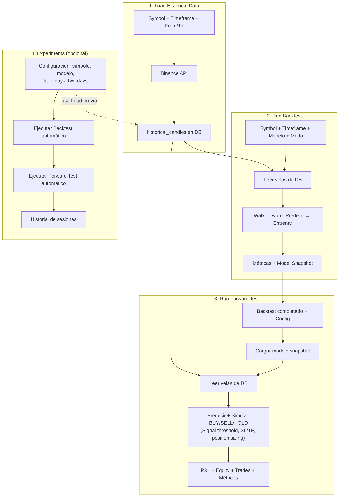

# Pipeline de Research: Carga → Backtest → Forward Test → Experiments

Este documento describe **todo** lo que hace la sección de Research de la app: qué herramientas hay, qué parámetros acepta cada una, qué métricas produce y cómo interpretarlas.

---

## Índice

1. [Load Historical Data](#1-load-historical-data)
2. [Run Backtest](#2-run-backtest)
3. [Modelos disponibles](#3-modelos-disponibles)
4. [Modos de predicción](#4-modos-de-predicción)
5. [Métricas del backtest](#5-métricas-del-backtest)
6. [Run Forward Test](#6-run-forward-test)
7. [Experiments (automatización)](#7-experiments-automatización)
8. [Cómo interpretar los resultados](#8-cómo-interpretar-los-resultados)
9. [Flujo completo (diagrama)](#9-flujo-completo-diagrama)

---

## 1. Load Historical Data

### Qué hace

Descarga velas (OHLCV) de la API de Binance y las guarda en la tabla `historical_candles` de PostgreSQL. Los datos se almacenan por `(symbol, timeframe, openTime)`. Si vuelves a cargar el mismo rango, las velas ya existentes se ignoran (upsert con `orIgnore`).

### Parámetros

| Parámetro | Descripción | Ejemplo |
|-----------|-------------|---------|
| **Symbol** | Par de trading en formato Binance (sin barra) | `BTCUSDT`, `ETHUSDT` |
| **Timeframe** | Granularidad de cada vela | `1m`, `5m`, `15m`, `1h`, `4h`, `1d` |
| **From** | Fecha de inicio (inclusiva) | `2024-01-01` |
| **To** | Fecha de fin (inclusiva) | `2024-06-30` |

### Timeframes disponibles

| Timeframe | Velas/día (aprox.) | Uso típico |
|-----------|---------------------|------------|
| `1m` | 1440 | Scalping, mucho ruido |
| `5m` | 288 | Intradía corto |
| `15m` | 96 | Intradía medio |
| `1h` | 24 | Swing corto |
| `4h` | 6 | Swing medio |
| `1d` | 1 | Posición, menos ruido |

**Importante:** el timeframe debe coincidir entre Load y Backtest. Los datos se guardan por `(symbol, timeframe)` — no puedes cruzar `1h` cargado con backtest en `5m`.

### ¿Es necesario cargar datos antes del backtest?

**Ya no.** El backtest detecta automáticamente si los datos están incompletos: calcula cuántas velas debería haber para el rango y timeframe solicitados, y si la cobertura es menor del 95%, **descarga automáticamente de Binance** lo que falta y lo guarda en la DB. Si después de descargar sigue sin haber suficientes velas (p. ej. porque Binance no tiene datos para ese par o rango), obtendrás un error explicativo.

Aun así, Load Historical Data sigue siendo útil para:
- Pre-cargar datos masivos sin ejecutar un backtest.
- Rellenar rangos que quieras explorar en el calendario de velas antes de decidir qué backtest correr.

---

## 2. Run Backtest

El backtest entrena un modelo ML desde cero usando datos históricos y evalúa su capacidad predictiva mediante **walk-forward**: predice primero, entrena después, sin usar información del futuro. Si no tiene datos suficientes para el rango solicitado, **los descarga automáticamente de Binance** antes de empezar.

### Parámetros

| Parámetro | Descripción | Valor típico |
|-----------|-------------|--------------|
| **Symbol** | Mismo que en Load | `BTCUSDT` |
| **Timeframe** | Mismo que en Load | `1h` |
| **From / To** | Rango de fechas. Debe estar dentro del rango cargado | `2024-01-15` – `2024-05-31` |
| **Prediction mode** | `RETURN` (regresión) o `VOLATILITY` (clasificación) | `RETURN` |
| **Model** | Tipo de modelo (ver sección 3) | `sgd_regressor` |
| **Warmup period** | Primeras N velas solo para entrenar, sin evaluar predicciones | 20–50 |
| **Volatility threshold** | Solo en modo VOLATILITY: movimiento mínimo (%) para clase 1 | `0.005` (0.5%) |

### Mínimo de velas requeridas

```
warmupPeriod + 26 + 2  velas
```

- **26:** las features (RSI-14, EMA-26, Bollinger-20, etc.) requieren 26 velas de historia.
- **2:** se predice el cierre de la vela `i+1` desde la vela `i`; se necesita al menos una vela posterior.
- **warmupPeriod:** velas iniciales donde solo se entrena sin evaluar.

### Cómo funciona (walk-forward)

```
1. Cargar velas de la DB para (symbol, timeframe, from, to)
2. Inicializar el modelo ML (vacío)
3. startIndex = max(warmupPeriod, 26)
4. Para cada vela i desde startIndex hasta length-2:
   a. Construir features con velas [0..i]  ← solo pasado, sin futuro
   b. Calcular target:
      - Modo RETURN:     target = log(close[i+1] / close[i])
      - Modo VOLATILITY: target = 1 si |cambio| > threshold, 0 si no
   c. PREDECIR primero (el modelo no ha visto aún el target de la vela i)
   d. Registrar error: predictedPrice vs actualPrice
   e. ENTRENAR después: partialTrain(features, target)
5. Calcular correlación de Pearson entre predicted_returns y actual_returns
6. Guardar snapshot del modelo (para Forward Test / Trading)
7. Devolver métricas + predictions
```

El orden **predecir → entrenar** es crítico y garantiza ausencia de data leakage: el modelo simula exactamente lo que haría en producción.

### Features que usa el modelo

El modelo recibe 14 features calculadas a partir del histórico de velas:

| Feature | Descripción |
|---------|-------------|
| `relative_range` | (high - low) / close — amplitud relativa de la vela |
| `log_return_1` | log(close[i] / close[i-1]) — retorno de la última vela |
| `log_return_5` | log(close[i] / close[i-5]) — retorno últimas 5 velas |
| `log_return_10` | log(close[i] / close[i-10]) — retorno últimas 10 velas |
| `log_return_20` | log(close[i] / close[i-20]) — retorno últimas 20 velas |
| `local_volatility` | Desviación estándar de log-returns recientes |
| `norm_volume` | Volumen normalizado respecto a la media |
| `volume_ratio` | Ratio volumen actual vs media reciente |
| `body_ratio` | |open - close| / (high - low) — fuerza del cuerpo de la vela |
| `rsi_14` | RSI de 14 periodos, normalizado (0–1) |
| `ema_ratio_short` | close / EMA corta — posición respecto a EMA rápida |
| `ema_ratio_long` | close / EMA larga (26) — posición respecto a EMA lenta |
| `macd_norm` | MACD normalizado |
| `bb_position` | Posición en Bandas de Bollinger (0 = banda inferior, 1 = superior) |

---

## 3. Modelos disponibles

Hay 5 modelos seleccionables, todos con `partial_fit` (entrenamiento incremental vela a vela):

| Modelo | Tipo | Descripción | Modo compatible |
|--------|------|-------------|-----------------|
| **SGD Regressor** | Regresión lineal | Gradiente descendente estocástico. Rápido, interpretable. Buena línea base. | RETURN |
| **Passive Aggressive** | Regresión lineal | Actualiza agresivamente cuando comete errores, pasivo cuando acierta. Bueno en datos con cambios de régimen. | RETURN |
| **MLP Regressor** | Red neuronal | 2 capas ocultas (64, 32 neuronas), ReLU, Adam. Puede capturar relaciones no lineales entre features. | RETURN |
| **Ensemble (3 modelos)** | Regresión combinada | Entrena simultáneamente SGD + Passive Aggressive + MLP. Predicción = media de los 3. Más robusto que cualquier modelo individual. | RETURN |
| **SGD Classifier** | Clasificación | SGDClassifier con `loss="log_loss"`. Predice probabilidad de movimiento grande. Se usa con modo VOLATILITY. | VOLATILITY |

### Detalles internos de cada modelo (ML Engine)

```python
"sgd_regressor":    SGDRegressor(loss="squared_error", penalty="l2", alpha=0.0001, warm_start=True)
"passive_aggressive": PassiveAggressiveRegressor(C=0.1, warm_start=True)
"mlp_regressor":    MLPRegressor(hidden_layer_sizes=(64, 32), activation="relu", solver="adam", warm_start=True)
"sgd_classifier":   SGDClassifier(loss="log_loss", penalty="l2", alpha=0.0001, warm_start=True)
```

Todos usan `StandardScaler` para normalizar features. El Ensemble tiene su propio scaler compartido entre los 3 sub-modelos.

---

## 4. Modos de predicción

### RETURN (regresión)

- **Qué predice:** el log-return de la próxima vela, `log(close[i+1] / close[i])`.
- **Modelo:** cualquiera excepto SGD Classifier.
- **Señal de trading:** si `predictedReturn > threshold` → BUY; si `predictedReturn < -threshold` → SELL.
- **Problema habitual:** en crypto con timeframes cortos, el log-return es muy ruidoso. Los modelos lineales tienden a converger a predecir ≈ 0.

### VOLATILITY (clasificación)

- **Qué predice:** la probabilidad de que haya un movimiento grande en la próxima vela.
- **Modelo:** siempre SGD Classifier (se selecciona automáticamente).
- **Target binario:** `1` si `|close[i+1] - close[i]| / close[i] > volatilityThreshold`, `0` si no.
- **Predicción:** `predictProba` → probabilidad de clase 1 (movimiento grande).
- **Señal de trading:** si `probability > signalThreshold` (default 0.6) → señal activa.
- **Útil para:** decidir *cuándo* actuar (filtrar períodos de baja volatilidad), no *en qué dirección*.

---

## 5. Métricas del backtest

Los resultados se dividen en tres grupos:

### 5.1 Error de precio

| Métrica | Fórmula | Qué mide |
|---------|---------|----------|
| **MAE** | `mean(|predicted - actual|)` | Error medio en unidades de precio. |
| **RMSE** | `sqrt(mean((predicted - actual)²))` | Como MAE pero penaliza más los errores grandes. |
| **MAPE** | `mean(|predicted - actual| / actual) × 100` | Error en %. Útil para comparar activos con precios distintos. |

### 5.2 Error de retorno

| Métrica | Fórmula | Qué mide |
|---------|---------|----------|
| **MAE Return** | `mean(|predicted_logreturn - actual_logreturn|)` | Error en el espacio de log-returns (más relevante que precio). |
| **RMSE Return** | `sqrt(mean((predicted_logreturn - actual_logreturn)²))` | Sensible a errores grandes en retorno. |
| **Dir. Accuracy** | `(aciertos_dirección / total) × 100` | % de velas en que el modelo acertó si el precio sube o baja. |

**Sobre Dir. Accuracy:** un valor del ~50% significa que en "sube vs baja" el modelo equivale a lanzar una moneda. Esto es común en modelos lineales con datos ruidosos y **no implica que el código esté mal**: el modelo aprende a predecir ≈ 0 retorno, lo que resulta en dirección aleatoria.

### 5.3 Comparación con baseline y señal

| Métrica | Fórmula / Descripción | Interpretación |
|---------|-----------------------|----------------|
| **Naive MAE** | `mean(|previousClose - actual|)` | MAE del baseline "el precio no cambia". |
| **Skill Score** | `1 - (MAE_modelo / MAE_naive)` | **La métrica clave.** > 0 → mejor que naive; = 0 → igual; < 0 → peor. |
| **Sharpe (sim.)** | `mean(pnl) / std(pnl)` | Long cuando predice subida, short cuando baja. Rentabilidad ajustada por riesgo. |
| **Pred. Correlation** | Pearson(predicted_returns, actual_returns) | Mide si hay correlación lineal entre lo que predice y lo que ocurre. > 0.05 es señal potencial. |

**Regla rápida de lectura:**

- `Skill Score > 0.05` + `Correlation > 0.05` → el modelo tiene alguna señal. Vale la pena explorar.
- `Skill Score ≤ 0` + `Correlation ≈ 0` → el modelo no aporta sobre el baseline.

---

## 6. Run Forward Test

### Qué hace

Usa el **modelo ya entrenado** de un backtest completado para simular operativa en un periodo distinto. **No re-entrena.** Solo predice y ejecuta BUY/SELL/HOLD según la señal. Sirve para evaluar el modelo en datos **out-of-sample** y calcular P&L simulado.

### Parámetros

| Parámetro | Descripción | Valor típico |
|-----------|-------------|--------------|
| **Source Backtest** | Sesión de backtest COMPLETED con `modelSnapshotId` | Seleccionar de la lista |
| **From / To** | Rango de fechas. Por defecto debe ser ≥ fecha fin del backtest | `2025-01-01` – `2025-03-01` |
| **Initial Capital** | Capital inicial en USDT para la wallet virtual | `10000` |
| **Signal Threshold** | Retorno mínimo predicho para abrir posición | `0.0005` (RETURN), `0.6` (VOLATILITY) |
| **Fee Rate** | Comisión por operación | `0.001` (0.1%, típico Binance) |
| **Position Size %** | Fracción del capital disponible a invertir por señal | `0.5` (50%) |
| **SL Multiplier** | Stop Loss = entrada − (multiplicador × volatilidad × precio) | `2` |
| **TP Multiplier** | Take Profit = entrada + (multiplicador × volatilidad × precio) | `3` |
| **Allow in-sample** | Permite fechas dentro del periodo de entrenamiento | Desactivado por defecto |

### Cómo funciona la simulación

```
1. Cargar el backtest source (debe tener modelSnapshotId)
2. Validar fechas: from >= backtest.endDate (salvo allowInSample)
3. Cargar velas de la DB para (symbol, timeframe, from, to)
4. Cargar el modelo desde el snapshot (sin re-entrenar)
5. Inicializar wallet virtual con initialCapital
6. Para cada vela i:
   a. Comprobar SL/TP antes de evaluar señal:
      - Si precio ≤ stopLossPrice → SELL (STOP_LOSS)
      - Si precio ≥ takeProfitPrice → SELL (TAKE_PROFIT)
   b. Predecir log-return (RETURN) o probabilidad (VOLATILITY)
   c. Si predictedReturn > +signalThreshold y sin posición → BUY
      - Size = cash × positionSizePct × confidence
      - confidence = min(|signal| / threshold, 1)  ← más señal = más tamaño
      - Fijar SL: entrada - (slMultiplier × volatility × precio)
      - Fijar TP: entrada + (tpMultiplier × volatility × precio)
   d. Si predictedReturn < -signalThreshold y con posición → SELL (SIGNAL)
   e. Registrar equity, drawdown
7. Cerrar posición abierta al final (END_OF_TEST)
8. Devolver métricas de predicción + tradingMetrics
```

### Métricas de trading del Forward Test

| Métrica | Descripción |
|---------|-------------|
| **P&L** | Ganancia/pérdida total en USDT |
| **Return %** | Retorno porcentual sobre capital inicial |
| **Win Rate** | % de operaciones cerradas con beneficio |
| **Total Trades** | Número de operaciones completadas |
| **Max Drawdown %** | Mayor caída desde pico hasta valle en la equity curve |
| **Sharpe (trades)** | Sharpe ratio basado en los trades reales |
| **Profit Factor** | Suma ganancias / suma pérdidas. > 1 es positivo |
| **Avg Trade** | P&L medio por operación |
| **Equity Curve** | Gráfico de evolución del capital a lo largo del tiempo |
| **Trade Log** | Tabla con cada BUY/SELL, precio, cantidad, fee, P&L y razón (SIGNAL/STOP_LOSS/TAKE_PROFIT/END_OF_TEST) |

### Diferencia Backtest vs Forward Test

| | Backtest | Forward Test |
|---|----------|--------------|
| Modelo | Entrena desde cero (walk-forward) | Usa modelo ya entrenado |
| Datos | Periodo de entrenamiento | Out-of-sample (por defecto) |
| Objetivo | Medir calidad del modelo | Simular trading real con P&L |
| Re-entrenamiento | Sí, vela a vela | No |
| Salida | Métricas de predicción + snapshot | Métricas de predicción + métricas de trading |

---

## 7. Experiments (automatización)

### Qué es

Los **Experiments** permiten definir una configuración fija (symbol, timeframe, modelo, ventana de entrenamiento, ventana de forward test) y ejecutarla con un solo clic — o de forma periódica si se habilitan.

### Para qué sirven

- Comparar modelos de forma sistemática: mismo símbolo/timeframe, distintos modelos.
- Re-entrenar periódicamente con datos recientes sin configurar todo manualmente.
- Mantener un historial de sesiones ligadas a cada experimento.

### Parámetros

| Parámetro | Descripción | Ejemplo |
|-----------|-------------|---------|
| **Name** | Nombre descriptivo | `BTC 1h SGD 90d` |
| **Symbol** | Par de trading | `BTCUSDT` |
| **Timeframe** | Granularidad | `1h` |
| **Model** | Modelo ML (todos los disponibles) | `ensemble` |
| **Train days** | Ventana de entrenamiento en días (desde "hoy" hacia atrás) | `90` |
| **Fwd days** | Ventana de forward test en días | `7` |
| **Warmup** | Velas de calentamiento | `20` |
| **Capital (USDT)** | Capital inicial para el forward test simulado | `10000` |

### Cómo funciona al ejecutar

1. Calcula `from` y `to` del backtest usando `trainWindowDays` desde la fecha actual.
2. Ejecuta backtest → guarda snapshot del modelo.
3. Ejecuta forward test con el snapshot, en los siguientes `forwardWindowDays`.
4. Guarda los IDs de las sesiones resultantes (`lastBacktestSessionId`, `lastForwardSessionId`).
5. Puedes navegar a cualquiera de las dos sesiones desde el panel de Experiments.

### Estados

| Estado | Descripción |
|--------|-------------|
| `never run` | El experimento existe pero no se ha ejecutado |
| `RUNNING` | En curso |
| `SUCCESS` | Última ejecución completada sin errores |
| `FAILED` | Última ejecución falló (mensaje de error visible) |

---

## 8. Cómo interpretar los resultados

### El problema del 50% en Dir. Accuracy

**~50% de Directional Accuracy = el modelo en "sube vs baja" equivale a una moneda.**

Esto ocurre porque los modelos lineales en datos ruidosos convergen a predecir log-return ≈ 0:
```
predictedReturn ≈ 0  →  predictedPrice ≈ previousClose
```
Cuando la predicción está en el límite entre "sube" y "baja", pequeñas variaciones determinan el resultado → la dirección es casi aleatoria.

**No es un bug; es una característica del problema**: los precios de crypto en timeframes cortos se parecen a un random walk.

### Qué métricas importan realmente

| Prioridad | Métrica | Cuándo preocuparse |
|-----------|---------|---------------------|
| 1 | **Skill Score** | ≤ 0: el modelo no supera al baseline naive |
| 2 | **Pred. Correlation** | ≈ 0 o negativa: no hay señal lineal entre predicciones y realidad |
| 3 | **Sharpe (sim.)** | < 0: la estrategia long/short simulada pierde dinero |
| 4 | **Dir. Accuracy** | Solo útil si es claramente > 55% de forma consistente |
| 5 | **P&L (Forward Test)** | Negativo en out-of-sample: el modelo no generaliza |

### Señales de que algo funciona

- Skill Score consistentemente > 0.05 en varios periodos y timeframes.
- Correlation > 0.05 (hay algo de señal lineal).
- Forward Test P&L positivo en out-of-sample con comisiones incluidas.
- Profit Factor > 1 y Sharpe > 0.

### Por qué usar el Forward Test y no solo el Backtest

El backtest usa los mismos datos para entrenar y evaluar (walk-forward evita leakage, pero el modelo se ha adaptado a ese periodo). El Forward Test prueba en datos **que el modelo nunca vio**. Un modelo que funciona en backtest pero falla en forward test probablemente está sobreajustado al periodo de entrenamiento.

### Recomendaciones prácticas

- **Timeframes más largos (4h, 1d):** menos ruido, más señal potencial.
- **Ensemble:** más robusto que cualquier modelo individual; reduce varianza.
- **SGD Classifier (VOLATILITY):** útil para identificar períodos de alta actividad; no predice dirección.
- **Signal Threshold más alto:** menos operaciones pero de mayor convicción; reduce el impacto de las comisiones.
- **Ajusta SL/TP Multipliers:** multiplicadores bajos → stops más cercanos → más operaciones pequeñas; altos → stops más amplios → menos operaciones pero mayor drawdown potencial.

---

## 9. Flujo completo (diagrama)



**Orden de uso:**

1. **Load Historical Data** — cargar velas del rango que quieres investigar.
2. **Run Backtest** — entrenar el modelo y obtener métricas de predicción.
3. **Run Forward Test** — simular trading con el modelo entrenado en un periodo posterior.
4. **Experiments** — si quieres automatizar y comparar configuraciones sistemáticamente.
5. Revisar: Skill Score, Pred. Correlation, Forward Test P&L. Solo pasar a trading real si los tres son positivos de forma consistente.
