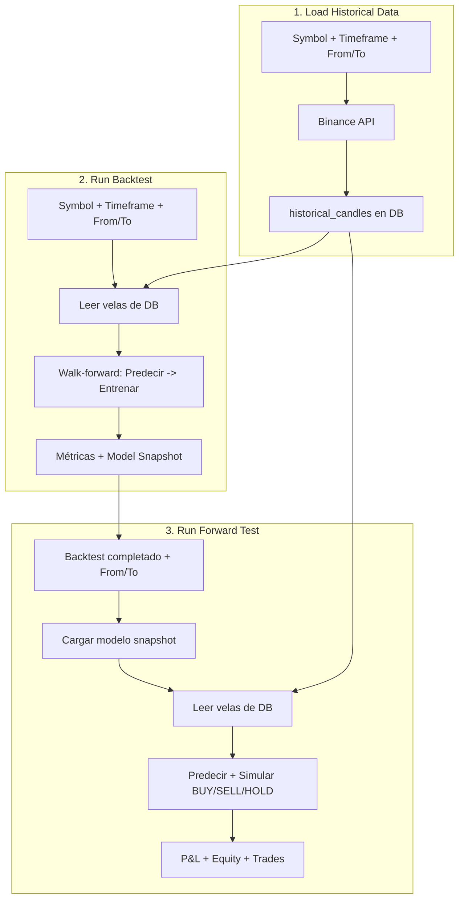

# Pipeline de Research: Load Historical Data → Run Backtest → Forward Test

Este documento explica el flujo completo desde la carga de datos históricos hasta el backtest y el forward test, qué significan los parámetros y por qué los resultados pueden parecer "demasiado buenos".

---

## 1. Load Historical Data

### Qué hace

Descarga velas (OHLCV) de la API de Binance y las guarda en la tabla `historical_candles` de PostgreSQL. Los datos se almacenan por `(symbol, timeframe, openTime)` — si vuelves a cargar el mismo rango, las velas existentes se ignoran (upsert con `orIgnore`).

### Parámetros

| Parámetro | Descripción | Ejemplo |
|-----------|-------------|---------|
| **Symbol** | Par de trading en formato Binance (sin barra) | `BTCUSDT`, `ETHUSDT` |
| **Timeframe** | Granularidad de cada vela | `1m`, `5m`, `15m`, `1h`, `4h`, `1d` |
| **From** | Fecha de inicio (inclusiva) | `2024-01-01` |
| **To** | Fecha de fin (inclusiva) | `2024-06-30` |

### Qué es el Timeframe y qué implica su elección

El **timeframe** define cuánto tiempo representa cada vela:

| Timeframe | Significado | Velas por día (aprox.) | Uso típico |
|-----------|-------------|-------------------------|------------|
| `1m` | 1 minuto por vela | 1440 | Scalping, mucho ruido |
| `5m` | 5 minutos | 288 | Intradía corto |
| `15m` | 15 minutos | 96 | Intradía medio |
| `1h` | 1 hora | 24 | Swing corto |
| `4h` | 4 horas | 6 | Swing medio |
| `1d` | 1 día | 1 | Posición, menos ruido |

**Implicaciones:**

- **Timeframes cortos (1m, 5m):** Más datos, más ruido, el mercado se parece más a un random walk. Las predicciones son más difíciles; el modelo suele tender a predecir ~0 (no cambio).
- **Timeframes largos (1h, 4h, 1d):** Menos datos por periodo, movimientos más suaves. Puede haber más señal, pero menos muestras para entrenar.

**Importante:** El timeframe que uses en Load debe coincidir con el del Backtest. Los datos se guardan por `(symbol, timeframe)` — no puedes mezclar `1h` cargado con backtest en `5m`.

### Fechas: ¿hay que haber recuperado datos antes?

**Sí.** El backtest **no** descarga datos por sí mismo. Lee exclusivamente de `historical_candles`.

Flujo correcto:

1. **Load Historical Data** con symbol, timeframe, from, to → se guardan velas en DB.
2. **Run Backtest** con el mismo symbol, timeframe y un rango de fechas **dentro** del que cargaste.

Si intentas un backtest con fechas para las que no hay datos, obtendrás un error tipo *"Not enough candles for backtest"*.

---

## 2. Run Backtest

### Parámetros

| Parámetro | Descripción | Valor típico |
|-----------|-------------|--------------|
| **Symbol** | Mismo que en Load | `BTCUSDT` |
| **Timeframe** | Mismo que en Load | `1h` |
| **From / To** | Rango de fechas del backtest. Debe estar **dentro** del rango cargado | Ej: `2024-01-15` a `2024-05-31` |
| **Model** | Tipo de modelo (SGD Regressor o Passive Aggressive) | `sgd_regressor` |
| **Warmup period** | Primeras N velas usadas solo para entrenar, sin predicciones | 20–50 |

### Requisito mínimo de velas

El backtest necesita al menos:

```
warmupPeriod + 26 + 2  velas
```

- **26:** Las features (RSI-14, EMA-26, Bollinger-20, logReturn-20, etc.) requieren 26 velas de historia.
- **2:** Se predice el cierre de la vela `i+1` desde la vela `i`; se necesita al menos una vela más para el target.
- **warmupPeriod:** Velas iniciales donde el modelo solo entrena, sin evaluar predicciones.

### Qué hace el backtest (paso a paso)

```
1. Cargar velas de la DB para (symbol, timeframe, from, to)
2. Inicializar el modelo ML (vacío)
3. startIndex = max(warmupPeriod, 26)
4. Para cada vela i desde startIndex hasta length-2:
   a. Construir features con velas [0..i] (solo pasado, sin futuro)
   b. Target = log(close[i+1] / close[i])  ← retorno real de i a i+1
   c. PREDECIR primero (walk-forward: el modelo aún no ha visto el target de la vela i)
   d. Registrar error: predictedPrice vs actualPrice, dirección, etc.
   e. ENTRENAR después: partialTrain(features, target)
5. Guardar snapshot del modelo para Forward Test / Trading en vivo
6. Devolver métricas: MAE, RMSE, MAPE, Directional Accuracy, Skill Score, etc.
```

### Walk-forward y ausencia de data leakage

El orden **predecir → entrenar** es crítico:

- En la vela `i`, el modelo **no** ha visto aún el target `log(close[i+1]/close[i])`.
- Las features usan solo `candles[0..i]` — ninguna información futura.
- Después de predecir, se entrena con ese target. Así se simula correctamente un escenario en tiempo real: predices con lo que sabes, luego el mercado revela el resultado.

---

## 3. ¿Por qué parece que "lo acierta todo"?

Varias razones pueden hacer que las predicciones se vean muy buenas:

### 3.1 Predicción ≈ "no cambio"

Los modelos lineales (SGD, Passive Aggressive) en datos ruidosos suelen converger a predecir **log-return ≈ 0**. Entonces:

```
predictedPrice = close[i] × exp(predictedLogReturn) ≈ close[i]
```

Si el precio real tampoco se mueve mucho (`close[i+1] ≈ close[i]`), la predicción parece correcta aunque en realidad solo estés diciendo "no pasa nada".

### 3.2 Métricas engañosas

- **MAE bajo:** Si predices ~precio actual y el precio cambia poco, el error absoluto es pequeño.
- **Directional Accuracy:** Se considera correcta si `(predictedPrice >= previousClose)` coincide con `(actualPrice >= previousClose)`. Si predices ≈ previousClose, estás en el límite; pequeños movimientos pueden hacer que "aciertes" por casualidad.

### 3.3 Skill Score es la métrica clave

El **Skill Score** compara tu MAE con el baseline naive ("predecir que el precio no cambia"):

```
Skill Score = 1 - (MAE_modelo / MAE_naive)
```

- **Skill Score ≤ 0:** El modelo no aporta ventaja sobre "no hacer nada".
- **Skill Score > 0:** El modelo mejora al baseline.

Si el backtest muestra Skill Score bajo o negativo, las predicciones "buenas" son en gran parte ilusión: el modelo no supera el baseline.

### 3.4 Visualización

En el gráfico de predicciones vs real, si ambas líneas van muy pegadas al precio, puede parecer que "acierta todo". Revisa el **Skill Score** y la **Directional Accuracy** frente al naive para tener una visión realista.

---

## 4. Run Forward Test

### Qué hace

Usa el **modelo ya entrenado** de un backtest completado para simular trading en un periodo distinto. No entrena: solo predice y ejecuta BUY/SELL/HOLD según la señal. Sirve para evaluar el modelo en datos **out-of-sample** (que no vio en el entrenamiento) y ver el P&L simulado.

### Parámetros

| Parámetro | Descripción | Valor típico |
|-----------|-------------|--------------|
| **Source Backtest** | Sesión de backtest COMPLETED con model snapshot | Seleccionar de la lista |
| **From / To** | Rango de fechas de la simulación. Debe haber velas cargadas para ese rango | Ej: `2025-12-26` a `2026-03-01` |
| **Initial Capital** | Capital inicial en USDT para la wallet virtual | 10000 |
| **Allow in-sample** | Si está activado, permite fechas dentro del periodo de entrenamiento del backtest | Desactivado por defecto |

### Restricción de fechas (out-of-sample)

Por defecto, el Forward Test exige que **From ≥ fecha fin del backtest**. Ejemplo: si el backtest entrenó hasta `2025-12-26`, el forward test debe empezar el 26/12/2025 o después. Así se garantiza que el modelo no ha visto esos datos.

Si quieres simular en el periodo de entrenamiento (in-sample), activa **Allow in-sample**. Los resultados serán más optimistas y no representan capacidad de generalización.

### Qué hace el forward test (paso a paso)

```
1. Cargar el backtest source (debe tener modelSnapshotId)
2. Validar fechas: from >= backtest.endDate (salvo allowInSample)
3. Cargar velas de la DB para (symbol, timeframe, from, to)
4. Cargar el modelo desde el snapshot (sin entrenar)
5. Inicializar wallet virtual con initialCapital
6. Para cada vela i desde 26 hasta length-2:
   a. Construir features con velas [0..i]
   b. Predecir log-return (solo predict, sin train)
   c. Si predictedLogReturn > +threshold  → BUY (si estamos en cash)
   d. Si predictedLogReturn < -threshold → SELL (si tenemos posición)
   e. Si no → HOLD
   f. Actualizar wallet, equity curve, drawdown
7. Cerrar posición abierta al final
8. Devolver: métricas de predicción (MAE, DirAcc, Skill Score) + tradingMetrics (P&L, win rate, drawdown, Sharpe, equity curve, trades)
```

### Diferencia Backtest vs Forward Test

| | Backtest | Forward Test |
|---|----------|--------------|
| Modelo | Entrena desde cero (walk-forward) | Usa modelo ya entrenado |
| Datos | Periodo de entrenamiento | Periodo posterior (out-of-sample) o cualquiera si allowInSample |
| Objetivo | Entrenar + evaluar precisión | Simular trading real con P&L |
| Salida | Métricas de predicción + snapshot | Métricas de predicción + tradingMetrics (P&L, equity, trades) |

---

## 5. Resumen del flujo



**Orden de uso:**

1. **Load Historical Data** (symbol, timeframe, from, to).
2. **Run Backtest** con el mismo symbol y timeframe, fechas dentro del rango cargado.
3. **Run Forward Test** seleccionando el backtest completado, fechas posteriores al fin del backtest (o allowInSample si quieres in-sample).
4. Revisar Skill Score, P&L simulado y métricas financieras; no fiarse solo de MAE o del gráfico.
